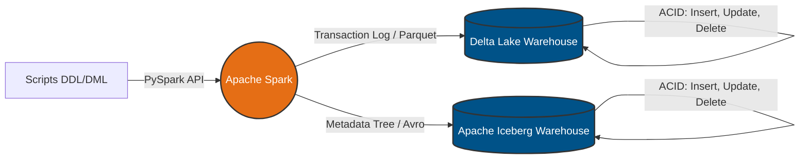

# Engenharia de Dados — Lakehouse para Sistema de Despachos (SED)

[](https://www.python.org/downloads/)
[](https://github.com/astral-sh/uv)
[](https://spark.apache.org/)
[](https://TiagoPalacio.github.io/Projeto_Eng_de_dados/)

Repositório desenvolvido para fins de pesquisa e aplicação prática na disciplina de Arquitetura de Dados. Este projeto demonstra a construção de uma arquitetura Lakehouse para o processamento de dados transacionais, utilizando **Apache Spark**, **Delta Lake** e **Apache Iceberg**. O ambiente simula as operações de backend e engenharia de dados necessárias para suportar as demandas de Sistemas Eletrônicos de Despachos (SED) e aplicativos de logística.

---

## 🏗️ Arquitetura da Solução

O fluxo de dados consiste na modelagem de um banco de dados transacional focado em entidades de logística (tabelas `motoristas` e `corridas`). O Apache Spark opera como o motor de processamento distribuído, executando comandos DML (Insert, Update, Delete) diretamente nas camadas de armazenamento (Delta e Iceberg). O objetivo principal é validar e comparar a eficácia das transações ACID em diferentes formatos de tabela aberta.



---

## 🛠️ Stack Tecnológico e Pré-requisitos

Para garantir o funcionamento adequado do projeto, certifique-se de que seu ambiente atende às especificações abaixo:

| Componente | Detalhe |
| :--- | :--- |
| **Sistema Operacional** | Windows (scripts de injeção de dependência nativos) / Linux / macOS |
| **Linguagem** | Python 3.11 |
| **Runtime** | Java 17 (Microsoft OpenJDK recomendado) — *Obrigatório para o Apache Spark* |
| **Gerenciamento de Pacotes**| `uv` (Fast Python package installer) |
| **Processamento** | PySpark (v3.5.1) |
| **Armazenamento Lakehouse** | Delta-Spark (v3.2.0) e PyIceberg |
| **Documentação** | MkDocs (Material Theme) |

---

## ⚙️ Instalação e Configuração do Ambiente

### 1. Instalação do gerenciador `uv`
Utilizamos o `uv` para garantir alta velocidade e isolamento rigoroso das dependências do projeto.

**Windows (PowerShell):**
```powershell
powershell -ExecutionPolicy ByPass -c "irm [https://astral.sh/uv/install.ps1](https://astral.sh/uv/install.ps1) | iex"
```

**Linux / macOS / Git Bash:**
```bash
curl -LsSf [https://astral.sh/uv/install.sh](https://astral.sh/uv/install.sh) | sh
```

### 2. Clonagem do Repositório
```bash
git clone [https://github.com/TiagoPalacio/Projeto_Eng_de_dados.git](https://github.com/TiagoPalacio/Projeto_Eng_de_dados.git)
cd Projeto_Eng_de_dados
```

### 3. Sincronização do Ambiente Virtual
O comando a seguir criará automaticamente o `.venv` e instalará as dependências, forçando o uso da versão correta do interpretador Python:
```bash
uv sync --python 3.11
```

---

## ▶️ Execução Local

O código está estruturado em Jupyter Notebooks para facilitar a análise interativa e a depuração das operações de banco de dados.

1. Abra o diretório do projeto no **Visual Studio Code**.
2. No canto superior direito do notebook, selecione o kernel correspondente ao ambiente virtual recém-criado (`.venv`).
3. **Validação Delta Lake:** Abra `delta_lakehouse.ipynb` e execute as células sequencialmente.
4. **Validação Apache Iceberg:** Abra `iceberg_lakehouse.ipynb` e execute as células sequencialmente.

> **Aviso para usuários de Windows:** Não é necessário configurar a variável de ambiente `HADOOP_HOME` manualmente. Os notebooks contêm um script de inicialização que realiza o download e a injeção dos binários `winutils.exe` e `hadoop.dll` em tempo de execução.

---

## ⚠️ Solução de Problemas Comuns (Troubleshooting)

* **Falha de inicialização Java/Py4J:** Caso a primeira execução retorne erros relacionados ao Hadoop ou Py4J, clique no botão **Restart** (Reiniciar Kernel) no Jupyter e reexecute a célula. Esse procedimento limpa o cache da JVM e permite a injeção correta dos binários do Windows.
* **Geração de Diretórios de Warehouse:** As pastas `spark-warehouse` e `iceberg_warehouse` são criadas automaticamente na raiz do projeto durante a execução. Elas estão mapeadas no `.gitignore` para evitar o versionamento de grandes volumes de dados locais.

---

## 📚 Documentação e Base de Conhecimento

A documentação técnica detalhada, incluindo o Modelo Entidade-Relacionamento (ER) e as justificativas arquiteturais, está disponível no diretório `docs/`.

**Servidor de documentação local:**
```bash
uv run --python 3.11 mkdocs serve
```
*Acesse o portal em: [http://127.0.0.1:8000/](http://127.0.0.1:8000/)*

**Deploy da documentação online:**
```bash
uv run --python 3.11 mkdocs gh-deploy
```
*Acesse a versão pública em: [Documentação do Projeto](https://TiagoPalacio.github.io/Projeto_Eng_de_dados/)*

---

## 👥 Contribuição

Sinta-se à vontade para contribuir com o projeto. Para isso, siga o fluxo padrão:

1. Abra uma **Issue** relatando o bug ou propondo uma melhoria.
2. Crie uma **Branch** a partir da `main` (`git checkout -b feature/minha-melhoria`).
3. Realize os **Commits** das suas alterações.
4. Abra um **Pull Request** detalhando as modificações realizadas.

---

## 👨‍💻 Autores

* **Tiago Fritzen Palácio**
* **Bruno Tescke**
* **Gabriel Tomé**

---

## 📄 Licença

Projeto desenvolvido para fins acadêmicos e disponibilizado como código aberto.

---

## 🔗 Referências e Links Úteis

* **Processamento de Dados:**
  * [Apache Spark - Documentação Oficial](https://spark.apache.org/docs/latest/)
  * [PySpark API Reference](https://spark.apache.org/docs/latest/api/python/index.html)
* **Formatos de Tabela Lakehouse:**
  * [Delta Lake - Quickstart com PySpark](https://docs.delta.io/latest/quick-start.html)
  * [Delta Lake - Tratamento de Exceções e AnalysisException](https://docs.delta.io/latest/delta-utility.html)
  * [Apache Iceberg - Spark Quickstart](https://iceberg.apache.org/spark-quickstart/)
  * [PyIceberg Documentation](https://py.iceberg.apache.org/)
* **Ferramentas de Desenvolvimento:**
  * [uv - Fast Python Package Manager](https://github.com/astral-sh/uv)
  * [MkDocs Material](https://squidfunk.github.io/mkdocs-material/)
