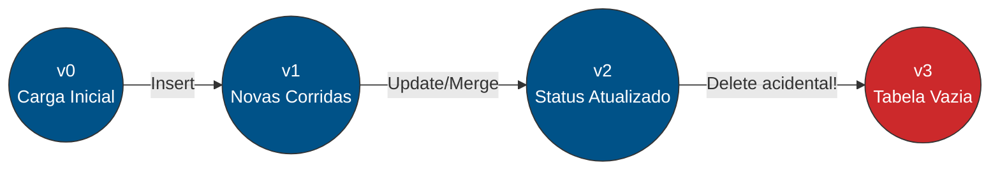

# 🌊 Delta Lake: Trazendo Ordem ao Caos do Data Lake

Seja bem-vindo(a) à documentação da nossa camada de armazenamento! Se você não está familiarizado com engenharia de dados, pode estar se perguntando: *"Por que não simplesmente salvar os dados em arquivos normais ou em um banco de dados tradicional?"*

Nesta página, vamos desmistificar o **Delta Lake** e explicar por que ele é uma peça fundamental no motor do nosso **Sistema Eletrônico de Despachos (SED)**.

---

## 🛑 O Problema: O "Pântano de Dados" (Data Swamp)

Historicamente, as empresas começaram a jogar todos os seus dados em **Data Lakes** (armazenamentos baratos, geralmente em arquivos `.parquet` ou `.csv`). Isso era ótimo para reduzir custos, mas criava um pesadelo logístico:

* O que acontece se dois motoristas atualizarem seus status ao mesmo tempo no mesmo arquivo?
* O que acontece se uma gravação falhar no meio do caminho por falta de internet? O arquivo fica corrompido?
* Como deletar os dados de um motorista específico (LGPD) no meio de um arquivo com 1 milhão de linhas?

Arquivos estáticos por si só **não** sabem lidar com esses cenários. O resultado? O lago de dados virava um pântano de dados corrompidos. 

### 📊 Comparativo: Data Lake vs. Delta Lake

| Característica | Data Lake Tradicional (Parquet/CSV) | Delta Lake |
| :--- | :--- | :--- |
| **Garantia de Escrita** | Nenhuma (falhas geram arquivos corrompidos) | **ACID** (Tudo ou Nada / Rollback automático) |
| **Evolução de Esquema** | Quebra o pipeline de leitura | Controlada nativamente (Schema Enforcement) |
| **Atualizações (DML)** | Requer reescrita total da partição/tabela | Suporta `UPDATE`, `DELETE` e `MERGE` granulares |
| **Histórico** | Inexistente (apenas o estado atual sobrevive) | Viagem no Tempo (Time Travel) via `_delta_log` |

---

## 🦸‍♂️ A Solução: Conheça o Delta Lake

O **Delta Lake** é uma camada de armazenamento open-source que "envelopa" esses arquivos estáticos (Parquet) e adiciona a eles os "superpoderes" de um banco de dados relacional tradicional.

!!! info "O Delta Lake no nosso Projeto (SED)"
    No nosso projeto, o Apache Spark faz o processamento pesado, mas é o Delta Lake que garante que os dados de **corridas** e **motoristas** sejam salvos de forma segura, rastreável e sem duplicações em nossa máquina local.

### 💎 Os 4 Pilares da Confiabilidade

Para o nosso cenário de logística, o Delta nos fornece quatro garantias essenciais:

#### 1. 🛡️ Transações ACID (Garantia de Integridade)
Se o sistema tentar registrar uma nova corrida com 5 etapas e o servidor cair na 4ª etapa, o Delta Lake desfaz (rollback) tudo automaticamente. Ou a operação acontece por inteiro, ou não acontece. Nada de dados "pela metade".

#### 2. 🗂️ Schema Enforcement (O Porteiro dos Dados)
Imagine que a coluna `id_motorista` espera um número inteiro, mas um erro no aplicativo envia a palavra `"João"`. O Delta Lake bloqueia essa gravação imediatamente, protegendo o pipeline de ser poluído com dados mal formatados.

#### 3. 🔄 Upserts com `MERGE` (A Mágica da Atualização)
Em logística, os status mudam a cada segundo. Com o comando `MERGE`, o Delta atualiza registros existentes ou insere novos em uma única passada de alta performance.

#### 4. 📜 Log de Transações (O Histórico Imutável)
Nos bastidores, o Delta cria uma pasta oculta chamada `_delta_log`. Lá dentro, ele anota em arquivos JSON absolutamente tudo o que aconteceu na tabela, atuando como o "cérebro" que gerencia a integridade dos arquivos Parquet.

---

## ⏳ Viagem no Tempo (Time Travel)

Graças ao Log de Transações (`_delta_log`), o Delta Lake sabe exatamente quais arquivos pertenciam a qual versão da tabela. Isso cria uma linha do tempo perfeita de todas as mutações do dado.

### Fluxo de Versionamento do Delta



Imagine o cenário acima (versão 3): Um desenvolvedor júnior executou um `DELETE` sem a cláusula `WHERE` e apagou a tabela inteira de motoristas. Em um banco de dados comum, o desespero bateria. No Delta Lake, nós podemos simplesmente **viajar no tempo de volta para a versão 2**.

!!! tip "Consultando o Passado"
    Você pode consultar os dados como eles eram em uma versão de commit específica ou até mesmo em um carimbo de data/hora específico.

**Exemplo em SQL:**
```sql
-- Consultando a tabela exatamente como ela estava na versão 2 (antes do erro)
SELECT * FROM motoristas VERSION AS OF 2;

-- Consultando a tabela como ela estava ontem à tarde
SELECT * FROM motoristas TIMESTAMP AS OF '2026-05-16 15:30:00';
```

**Exemplo na nossa API do PySpark:**
```python
# Lendo o DataFrame de motoristas restaurado da versão 2
df_motoristas_seguro = spark.read \
    .format("delta") \
    .option("versionAsOf", 2) \
    .load("caminho/para/warehouse/motoristas")
```

Essa funcionalidade não serve apenas para corrigir erros humanos, mas também para treinar modelos de Machine Learning reproduzíveis em nosso Lakehouse (garantindo que o modelo preditivo do SED seja treinado exatamente com os dados que existiam naquela data específica).

---

## 🚀 Próximos Passos

Agora que você entende o papel vital do Delta Lake e como ele protege nossos dados, convidamos você a abrir o notebook `delta_lakehouse.ipynb` no repositório. Lá, você verá todos esses conceitos (ACID, Merge, Time Travel) sendo executados na prática, linha por linha!
