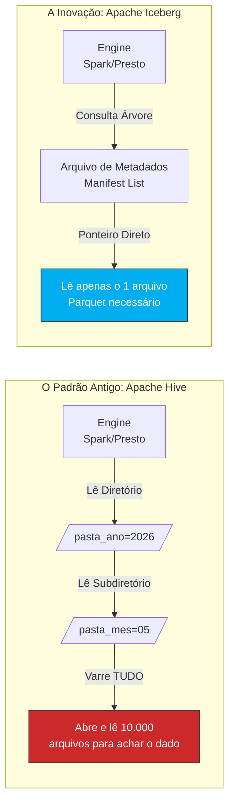

# 🧊 Apache Iceberg: O Padrão Ouro para Escala Maciça

Bem-vindo(a) à documentação do nosso segundo pilar de armazenamento! Se o Delta Lake é a nossa ferramenta de escolha para transações rápidas e log de operações, o **Apache Iceberg** é a nossa resposta para **escalabilidade extrema** e evolução arquitetural de longo prazo.

---

## 🎬 A Origem: O Problema da Netflix (e do Hive)

Para entender o verdadeiro valor do Iceberg, precisamos voltar um pouco no tempo. Antigamente, o padrão da indústria para organizar Data Lakes era o Apache Hive. O Hive rastreava os dados olhando puramente para **pastas** (diretórios físicos) dentro do servidor. 

!!! warning "O Gargalo dos Diretórios"
    Quando a Netflix tentou processar *petabytes* de dados, o processo de descobrir quais arquivos ler dentro das pastas demorava mais do que a leitura em si! Além disso, o sistema de arquivos não garantia segurança: se alguém alterasse um arquivo enquanto outro estava lendo, o resultado era um erro crítico.

O **Apache Iceberg** foi criado pela Netflix (e depois doado para a fundação Apache) para resolver exatamente esse gargalo de performance. Ele abandona a leitura lenta de pastas físicas e adota uma **árvore inteligente de metadados**.

### 📊 Comparativo de Arquitetura de Leitura

---

## 🚀 Os Diferenciais Tecnológicos no nosso Sistema (SED)

No contexto do nosso aplicativo de logística, o Iceberg brilha em três áreas fundamentais que facilitam a vida dos Engenheiros de Dados:

### 1. 🧬 Evolução Total do Esquema (Schema Evolution)
Sistemas de logística mudam o tempo todo. Hoje, a tabela `corridas` pode ter apenas o `id_motorista`. Amanhã, o negócio exige adicionar `tipo_veiculo`, renomear `valor_total` para `tarifa_base` e mudar um tipo de dado de `INT` para `BIGINT`.

* **O jeito antigo:** Você precisaria reconstruir a tabela inteira, o que custa processamento, tempo e dinheiro.
* **O jeito Iceberg:** As alterações são feitas apenas nos metadados. É possível adicionar, remover, renomear ou reordenar colunas de forma instantânea, sem a necessidade de reescrever um único arquivo de dados antigo.

### 2. 🕵️‍♂️ Particionamento Oculto (Hidden Partitioning)
Particionar dados (por exemplo, agrupar corridas por mês) deixa as consultas infinitamente mais rápidas. O problema é que, tradicionalmente, o desenvolvedor ou analista precisava saber exatamente como a tabela estava particionada e incluir filtros manuais na query para não derrubar o banco.

| Característica | Padrão Tradicional (Hive/Spark) | Apache Iceberg (Hidden) |
| :--- | :--- | :--- |
| **Geração da Partição** | Exige criação de nova coluna física (ex: `mes_corrida`) | Gerado no metadado via transformação (`month(data)`) |
| **Regra de Consulta** | Analista DEVE usar `WHERE mes_corrida = '05'` | Analista usa a data natural `WHERE data = '2026-05-17'` |
| **Risco de Performance**| Alto (Esquecer o filtro varre a tabela inteira - *Full Scan*) | Nulo (Iceberg traduz o filtro e acha a partição sozinho) |

!!! success "Magia sob o capô"
    Com o Particionamento Oculto, se você consultar `SELECT * FROM corridas WHERE data_corrida = '2026-05-17'`, o próprio Iceberg entende a relação temporal através de seus metadados e puxa apenas a partição correta de maio de 2026, ignorando o resto do Lakehouse automaticamente.

### 3. 📸 Isolamento de Snapshot (Snapshot Isolation)
Em um sistema de despachos 24/7, teremos fluxos contínuos escrevendo novos dados de motoristas, enquanto analistas de BI tentam consolidar relatórios mensais ao mesmo tempo.
O Iceberg garante que as leituras sejam 100% isoladas das escritas. O usuário que está consultando sempre verá uma "foto" (snapshot) consistente da tabela, mesmo que bilhões de linhas estejam sendo inseridas por debaixo dos panos naquele exato momento.

---

## 📦 Caso de Uso: Armazenamento de Longo Prazo

No **Sistema Eletrônico de Despachos (SED)**, posicionamos o Apache Iceberg como o formato ideal para o **histórico de longo prazo**. 

Como os dados históricos crescem vertiginosamente com o passar dos anos, e as regras de negócio invariavelmente mudam, a capacidade do Iceberg de lidar com alto volume e evoluir o esquema sem reescrita pesada o torna a escolha definitiva para nossa camada de dados "frios/mornos".

!!! tip "Veja na Prática"
    Quer ver como a evolução de esquema e as árvores de metadados funcionam a nível de código?
    Abra o notebook `iceberg_lakehouse.ipynb` na raiz do nosso repositório e execute os testes práticos locais usando o PySpark!
