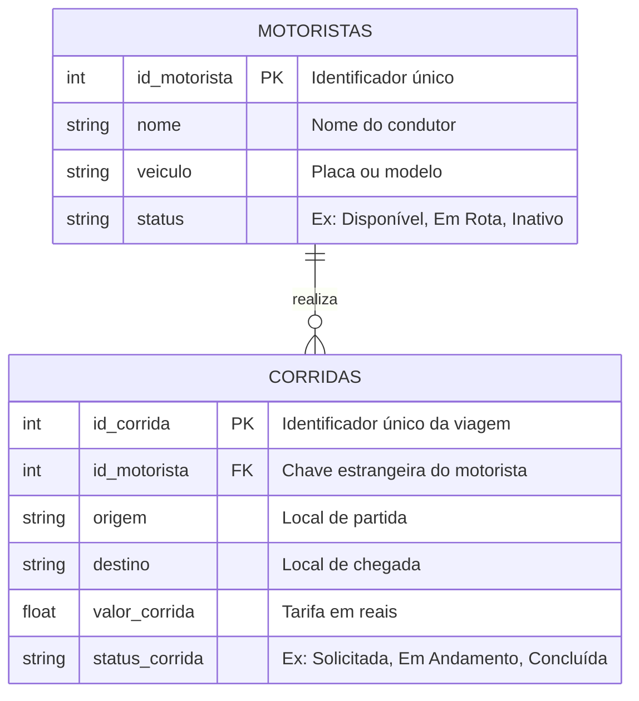

# 📦 Sistema Eletrônico de Despachos (SED): Arquitetura Lakehouse

Bem-vindo(a) à base de conhecimento do nosso projeto de pesquisa em **Arquitetura de Dados**! 

Este site foi criado para documentar e explicar, de forma didática e visual, a implementação de uma arquitetura Lakehouse moderna utilizando **Apache Spark**, **Delta Lake** e **Apache Iceberg**.

!!! abstract "O Objetivo do Projeto"
    O foco principal desta pesquisa é demonstrar como lidar com **dados transacionais de alta frequência** fora de um banco de dados relacional tradicional, utilizando as garantias ACID (Atomicidade, Consistência, Isolamento e Durabilidade) fornecidas por formatos de tabela aberta em um Data Lake.

---

## 🎯 Contextualização do Cenário (Business Case)

Para tirar as ferramentas do campo teórico e testá-las na prática, modelamos um caso de uso do mundo real: um **Sistema de Despachos e Logística (SED)**. 

!!! info "Por que escolhemos logística?"
    Sistemas de transporte (como aplicativos de carona, entregas de aplicativos ou gestão de frotas) geram um volume massivo de dados onde as mudanças de estado são contínuas. Motoristas mudam de *"Disponível"* para *"Em Rota"* a todo segundo, e as viagens são criadas, atualizadas e canceladas em tempo real. Esse é o cenário de estresse perfeito para testar o poder e a confiabilidade de operações DML (Insert, Update, Delete) em um Lakehouse.

---

## 📊 Modelo Entidade-Relacionamento (ER)

Nosso banco de dados simulado é focado, desenhado especificamente para testar o relacionamento entre entidades e a atualização constante de registros. Ele é composto por duas tabelas principais, conectadas através de uma relação de *Um-para-Muitos (1:N)* via `id_motorista`:

### 🔍 Entendendo as Entidades no Contexto de Dados

* **`MOTORISTAS` (Dimensão):** Armazena o cadastro e o estado atual da frota. É nesta tabela que testaremos as pesadas operações de `MERGE` (Upsert), garantindo que o status de localização e disponibilidade de cada motorista seja atualizado rapidamente sem gerar registros duplicados.
* **`CORRIDAS` (Fato):** Registra o histórico transacional imutável das viagens. Por ser uma tabela de crescimento rápido e volume constante, é o laboratório ideal para validarmos o isolamento de snapshots, particionamento de dados e a evolução de esquema (Schema Evolution) do Apache Iceberg.

---

**Pronto para explorar a engenharia por trás do sistema?** Navegue pelo menu lateral para mergulhar nas explicações de como configuramos o ecossistema Spark e estruturamos nossas camadas de dados!
